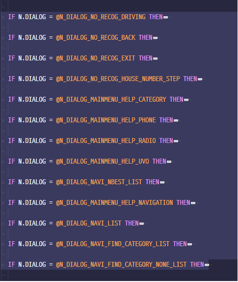

# MZLP-SORT - LP소스 정렬 패키지

## 사용법

* 정렬을 원하는 IF문의 시작부터 (첫줄의 ‘IF’ 앞의 탭까지 선택 해야합니다)
* IF문의 내용의 끝 (~END)까지 선택 (드래그)
* 단축키 `Ctrl + Alt + Shift + S` 실행
* mzlp-pack의 Fold(접기기능)을 사용하면 더 편리합니다.
* `ctrl + alt + a` 전체접기
* `ctrl + alt + s` 현재 커서 스코프 접기
* `ctrl + alt + d` 현재 커서 스코프 펼치기
* `ctrl + alt + f` 전체펼치기

## 주의사항
* `1탭(\t)` IF  -> 시작
* `2탭(\t\t)` END  -> 끝
* 의 구조를 따라야지 인식이 됩니다.